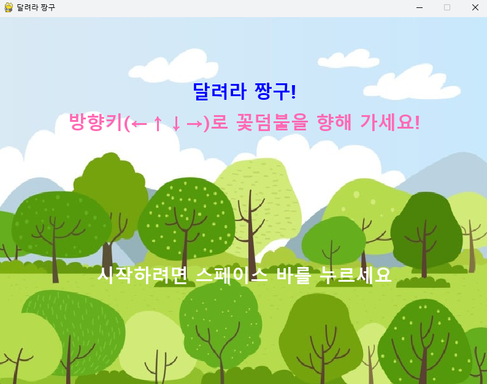

# MINI_GAME 프로젝트 🎮

이 레포지토리는 두 가지 미니게임을 포함하고 있습니다.

---

## 1. [MarioGame](./MarioGame/README.md)
- **기술 스택:** HTML, CSS, JavaScript(jQuery)
- **게임 설명:** 마리오가 코인을 모으며 장애물을 피하는 미니게임.
- **실행 방법:** `main.html`을 브라우저로 열기.

---

## 2. [Parentsday Game](./parentsday_game/README.md)
- **기술 스택:** Python, Pygame
- **게임 설명:** 덤불 속 숨겨진 카네이션을 찾아내는 미니게임.
- **실행 방법:**
  ```bash
  pip install pygame
  python game.py
  ```

---

## 📦 폴더 구조
```
MINI_GAME/
├── MarioGame/
│   ├── main.html
│   └── README.md
├── parentsday_game/
│   ├── game.py
│   └── README.md
└── README.md
```

---

## 👾🕹️게임 미리보기

### MarioGame
<p align="center">
  
  
</p>
<p align="center">
  메인 화면 &nbsp;&nbsp;&nbsp;&nbsp;|&nbsp;&nbsp;&nbsp;&nbsp; 플레이 화면
</p>

### 달려라 짱구
<p align="center">
  
  
</p>
<p align="center">
  시작 화면 &nbsp;&nbsp;&nbsp;&nbsp;|&nbsp;&nbsp;&nbsp;&nbsp; 플레이 화면
</p>


---

## 라이선스
이 프로젝트는 개인 학습용 예제로 제작되었습니다.
